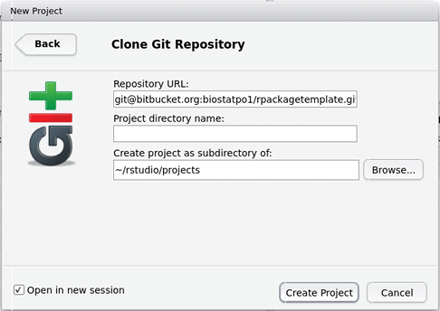
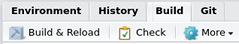

# README #

This repository contains an R package template supporting the use of the Rcpp and/or RcppArmadillo packages. The package template has been configured as an RStudio project, and the following instructions assume you have [RStudio](https://www.rstudio.com/) installed. To make full use of RStudio, the [devtools](https://cran.r-project.org/web/packages/devtools/index.html) R package should also be installed. The package template includes both `R` and `C++` code, so a [suitable](https://cran.r-project.org/doc/manuals/r-release/R-admin.html) `C++` compiler must be available to build the package from source.

1. [Configuring RStudio for Git and SSH](#configuring-rstudio-for-git-and-ssh)
2. [Registering your SSH public key with bitbucket](#registering-your-ssh-public-key-with-bitbucket)
3. [Cloning the project repository with RStudio](#cloning-the-project-repository-with-rstudio)
4. [Building and running the package template project with RStudio](#building-and-running-the-package-template-project-with-rstudio)

### Configuring RStudio for Git via SSH

The package source code is stored in a Git repository, which is accessible using the SSH (__S__ecure __SH__ell) protocol. Connecting to a remote Git repository requires a Git client be installed on your system. To establish if RStudio has recognized your Git installation, click on the __Tools__ menu and select __Global Options...__ (this dialog may load slowly the first time it is opened). Click on __Git/SVN__ in the left panel, and make sure the checkbox __Enable version control interface for RStudio projects__ has been selected (RStudio may need to be restarted after turning this feature on or off).

If the __Git executable__ is __(Not Found)__, you probably need to install a Git client; for instructions click [here](https://www.atlassian.com/git/tutorials/install-git) (or just google it).

Once RStudio has recognized your Git installation, check to see if it has found a __SSH RSA Key:__ 

1. If the __SSH RSA Key__ is __(None)__, make one by clicking the __Create RSA Key...__ button. Using a passphrase is more secure, albeit less convenient.  

2. If the __SSH RSA Key__ is the one you want to use, nothing needs to be done.
    
3. If the __SSH RSA Key__ is not the one you want to use, complain to RStudio, because as far as I can tell it cannot be changed by the user. In Linux a workaround is to set the environment variable `GIT_SSH_COMMAND='ssh -i /path/to/alternate/key/id_rsa'` before running RStudio, overriding the default key selection.

The RSA public key will be used to identify and authenticate you when connecting to the Git host via SSH. In cases 1 and 2 above, you can access this file by clicking __View public key__. This key must be registered with the Git host, so you may want to copy and paste it into a temporary text file.

In case 3 above, it is assumed that anyone using something other than the default knows how to find the appropriate public key.

### Registering your SSH public key with bitbucket

To register your public key, log in to bitbucket and click on your avatar, which is located in the top right corner and defaults to the image . From there, select __Bitbucket settings__, and then click on __SSH Keys__ in the left panel.

Next, click on __Add key__, and paste the public key from before into the text box. It is recommended to label your SSH keys, particularly when using more than one. Press the __Add key__ button when finished.

### Cloning the project repository with RStudio

With RStudio configured for Git, and your SSH key registered with the Git host, you are ready to clone the package template project repository. From the __File__ menu select __New Project...__, then click on __Version Control__ followed by __Git__. Enter *git@bitbucket.org:biostatpo1/rpackagetemplate.git* for the __Repository URL__, and leave the __Project directory name__ empty. When the repository is cloned, a new directory named *rpackagetemplate* will be created. 

The field __Create project as subdirectory of__ indicates where the *rpackagetemplate* directory will be created. To specify an alternate location, click __Browse...__ and navigate to the desired file system path. If __Open in new session__ is checked, once the clone operation is complete RStudio will automatically open the project. After setting the appropriate option values, click the __Create Project__ button to clone the repository using Git.

### Building and running the package template project with RStudio

To build and run the project, it must be open in RStudio (this should already be the case if __Open in new session__ was selected). If the project is not open, click on __File__ and select __Open Project...__, then navigate to the newly created *rpackagetemplate* folder and open the *rpackagetemplate.Rproj* file (the *.Rproj* extension denotes a configuration file for an RStudio project). When the project is open, one of the panes in the RStudio window should have a series of tabs including __Environemnt__, __History__, __Build__, and __Git__ (the RStudio interface can be customized by selecting __Pane Layout__ from the left panel of the __Global Options__ dialog). Click on the tab labeled __Build__.

Clicking the __Build & Reload__ button causes R to compile and load the contents of the project directory. Because the project contains `C++` code, you should see some lines of compiler output. The package is then installed, and as with any R package, if this completes successfully the last few lines of output will look like:

    ** testing if installed package can be loaded
    * DONE (rpackagetemplate)

Assuming the package has been built successfully, it is automatically (re)loaded by calling `library(rpackagetemplate)`. To verify the package installation, you can run the included "hello world" function `rcpparma_hello_world`, which should return a 3x3 matrix that has seven on the diagonal and zero elsewhere.

    >rcpparma_hello_world()
         [,1] [,2] [,3]
    [1,]    7    0    0
    [2,]    0    7    0
    [3,]    0    0    7