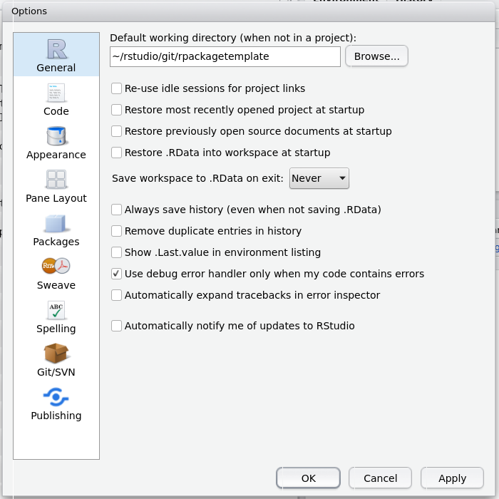

# README #

This repository provides an R package template supporting the use of the Rcpp
and/or RcppArmadillo packages.

## RStudio, Git, and SSH Keys

The R package source code is stored in a git repository, which is accessible using the ssh (__s__ecure __sh__ell) protocol. Connecting to a remote git repository requires a git client to be installed on your system. To establish if RStudio has recognized your git installation click on the `Tools` menu and select `Global Options...` (this dialog may load slowly the first time it is opened), then click on `Git/SVN` in the left panel.

If your Git executable is shown as `(Not Found)`, you probably need to install a git client; for instructions click [here](https://www.atlassian.com/git/tutorials/install-git) (or just google it).

Once RStudio has recognized your git installation, check to see if it has found a `SSH RSA Key`. 

- If a key has not been found, make one by selecting `Create RSA Key...`. The passphrase is optional; using one is more secure, albeit less convenient. 

    
- If a key has been found and it is the one you want to use, nothing needs to be done.
    
- If a key has been found and it is not the one you want to use, complain to RStudio, because as far as I can tell it cannot be changed by the user. In Linux a workaround is to set the environment variable `GIT_SSH_COMMAND='ssh -i /path/to/alternate/key/id_rsa'` before running RStudio, overriding the default key selection.

